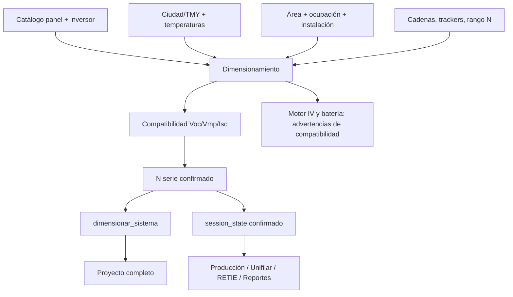

# Design: CodeSpec del módulo Dimensionamiento

## Flujo de datos

## Propiedad de los datos

- `panel_dict`, `inversor_dict_dim`, `panel_nombre_dim` e `inversor_nombre_dim` representan la selección viva.
- `N_serie`, `N_str_tr_usado`, `N_serie_panel_ref` y `N_serie_inversor_ref` representan el último diseño confirmado.
- `N_str_tr` es un widget recalculable y no debe ser consumido como diseño confirmado por páginas downstream.
- `N_paneles_granja`, `N_inv_total` y `P_dc_total_kWp` son salidas de proyecto y deben conservar la referencia del inversor que las produjo.

## Decisión de diseño

La función `diseno_electrico_confirmado(session_state)` es la frontera única para consumidores downstream. La UI puede recalcular sugerencias, pero solo los botones de confirmación actualizan el diseño consumible.

## Compatibilidad hacia atrás

Se mantienen las claves existentes de `session_state`, las firmas de las funciones puras y el criterio actual de semáforos. Las CodeSpecs deben añadirse como pruebas y documentación antes de extraer componentes de la página.
