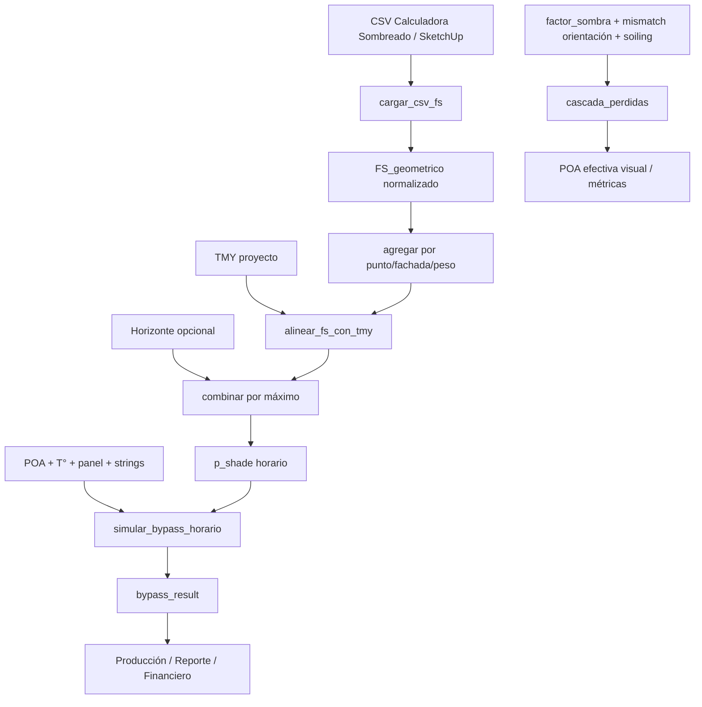

# Design: CodeSpec de Mismatch y Pérdidas de Sombreado

## Flujo de datos

## Contrato CSV

- Requeridas: `Mes`, `Dia`, `Hora`, `FS_geometrico`.
- `FS_geometrico` se limita a `[0,1]`, donde `0=sin sombra` y `1=sombra total`.
- Se aceptan meses numéricos o abreviaturas español/inglés.
- `FS` se reconstruye desde `FS_geometrico`; no se copia el FS combinado del archivo.
- Se conservan fachada, punto, fila, obstáculo e identificadores causales.

## Contrato de alineación

- `mensual`: replica el patrón del día crítico a todos los días del mes; recomendado para estimación anual.
- `exacto`: usa solo coincidencias `(mes,dia,hora)`; recomendado para auditoría.
- La serie resultante tiene el mismo índice y longitud del TMY; horas sin dato quedan en cero.
- La ponderación por punto se audita y se conserva en `Series.attrs["agregacion_fs"]`.

## Contrato eléctrico

- El bypass usa el SDM central de `modelo_iv.py`.
- Con Motor Óptico activo y `poa_sin_termico_df` disponible, el bypass usa esa POA; el SDM aplica la temperatura una sola vez con `NOCT` y `k_BIPV`.
- Con Motor Óptico activo y `poa_sin_termico_df` ausente, Página 5 y Producción bloquean el cálculo; `poa_efectiva_df` y la POA bruta no son fallbacks válidos para el SDM.
- Los escenarios comparativos propagan el mismo `k_BIPV` del proyecto al cálculo de bypass.
- La condición de bypass es `Isc_sombreado < Imp_claro`.
- La pérdida reportada es adicional frente a la referencia uniforme, no la pérdida solar POA.
- La pérdida AC equivalente se calcula downstream con la eficiencia del inversor.

## Contrato de vigencia

- `resolver_poa_bypass()` sanea el bypass antes de cualquier lectura de `bypass_ok` o `bypass_result` en Página 5.
- `exigir_poa_sin_termico()` impide que Producción use una POA térmicamente ambigua aunque Página 5 no se haya visitado.
- Al reemplazar la POA del Motor Óptico, `invalidar_downstream_motor_optico()` caduca todos los resultados monofaciales dependientes antes de publicar la nueva POA.
- La invalidación incluye resultados en memoria y la persistencia de Producción en disco.
- `KEYS_BYPASS_RESULTADO` debe permanecer incluido en `KEYS_DERIVADOS_POA`; las pruebas verifican esta relación.
- Las claves multi-superficie se excluyen de esta invalidación porque su POA se calcula independientemente en Página 9.

## Contrato de cascada

`cascada_perdidas()` construye una cascada POA visual con sombreado de horizonte, mismatch de orientación, fabricación, soiling y cableado DC. Producción aplica por separado pérdidas eléctricas explícitas como fabricación, cableado y bypass para evitar doble conteo.
