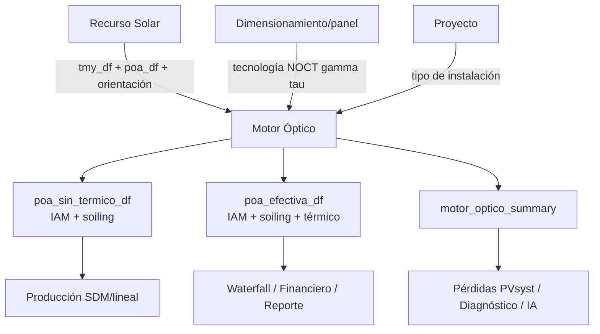

# Design: CodeSpec del Motor Óptico BIPV

## Flujo de datos

## Contrato físico

- `poa_bruta` es la POA de Recurso Solar sin correcciones del Motor Óptico.
- `poa_optica` aplica IAM directa y difusa.
- `poa_post_soil` aplica soiling.
- `poa_post_term` aplica el factor térmico.
- `poa_efectiva` equivale a `poa_post_term` y no incorpora `tau`.
- `poa_efectiva_celda` es informativa y equivale a `poa_post_term * (1 - tau)`.

## Contrato de estado

- `motor_optico_ok`, `motor_optico_result_df` y `motor_optico_summary` indican cálculo vigente.
- `poa_sin_termico_df` es la entrada óptica corregida para el SDM.
- `poa_efectiva_df` es la salida completa para presentación y resúmenes.
- `motor_optico_k_bipv` y `motor_optico_noct` son la fuente de verdad térmica downstream.
- El cambio de ciudad/coordenadas debe limpiar todos los derivados POA y Motor Óptico.

## Frontera de responsabilidad

El Motor Óptico no dimensiona strings, no calibra el SDM y no sustituye el Motor IV. Su responsabilidad es transformar POA bruta y TMY en irradiancia corregida y parámetros térmicos trazables.
