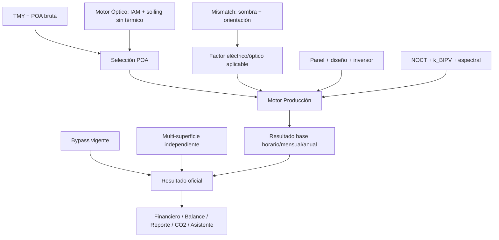

# Design: CodeSpec del Módulo Producción

## Flujo propietario

## Contrato propuesto de entrada

Cada corrida debe registrar `produccion_run_signature_v1`, una huella determinista de la corrida base, construida desde un objeto canónico con:

- identidad del panel e inversor seleccionados;
- `N_paneles`, potencia STC, `N_serie`, strings/tracker y número de inversores;
- eficiencia del inversor, potencia CA nominal y modo IV solicitado;
- método físico efectivo (`jrc_huld`, `sdm_pvsyst`, `motor_iv` o `lineal`);
- fuente de POA y huellas de su índice/`poa_global` y del índice/T2m del TMY;
- estado y parámetros de Motor Óptico;
- factores separados de sombra, orientación, soiling, fabricación y cableado;
- `NOCT`, `k_BIPV`, corrección espectral y potencia CA nominal;
- fuente de pérdidas óhmicas.

La firma base no incluye bypass ni multi-superficie, que tienen ciclos de vida downstream separados. Su payload canónico tiene exactamente estas claves:

- `signature_version`: entero `1`;
- `panel_fingerprint`: SHA-256 del mapping completo devuelto por `resolver_panel_calibrado()` tras normalización recursiva;
- `panel_nombre`: cadena;
- `inverter_fingerprint`: SHA-256 del mapping completo del inversor seleccionado tras normalización recursiva;
- `inversor_nombre`: cadena;
- `N_paneles`, `N_serie`, `N_strings_tracker`, `n_inversores`: enteros o `null`;
- `P_dc_stc_kW`, `eta_inversor`, `P_ac_nom_W_total`, `NOCT`, `k_bipv`: flotantes finitos o `null`;
- `produccion_usar_iv`: booleano;
- `source_mode`: cadena entre `jrc_huld`, `sdm_pvsyst`, `motor_iv`, `lineal`;
- `tmy_T2m_fingerprint`: huella horaria de índice + `T2m`;
- `poa_source`: cadena entre `poa_df`, `poa_sin_termico_df`;
- `poa_global_fingerprint`: huella horaria de índice + `poa_global`;
- `factor_mismatch_aplicado`: flotante finito;
- `factor_espectral_fingerprint`: huella horaria o `null`;
- `pct_mismatch_fab`, `pct_cableado_dc`, `pct_cableado_ac`: flotantes finitos o `null`;
- `perdida_ohmica_fingerprint`: SHA-256 del mapping vigente completo o `null`.

La normalización recursiva de mappings ordena claves como cadenas, conserva booleanos/enteros/cadenas/`null`, convierte flotantes finitos a `float.hex()` y normaliza listas/tuplas en orden; tipos no soportados se rechazan. La representación canónica se serializa como JSON UTF-8 con `sort_keys=True`, `separators=(",", ":")` y `ensure_ascii=True`. Se rechazan `NaN`/infinitos. Las huellas horarias usan SHA-256 sobre: zona horaria UTF-8 (cadena vacía si el índice es naive), índice convertido a UTC cuando tiene zona como enteros `int64` nanosegundos little-endian y valores contiguos `float64` little-endian; valores no finitos se rechazan antes de firmar. El digest final también es SHA-256.

La misma firma se guarda en `res_produccion`, `session_state` y la persistencia. Si la firma esperada no puede reconstruirse o no coincide con la guardada, `produccion_ok` se invalida y ninguna salida anterior se republica con metadatos nuevos.

## Propiedad del factor Mismatch

Página 5 conserva `factor_global_mismatch` por compatibilidad y publica además `factor_mismatch_sin_soiling`. Su fórmula exacta es `(1 - factor_sombra_anual) * (1 - factor_mismatch_or_pct / 100)`, limitada a `[0, 1]`; una entrada ausente equivale a pérdida cero. La clave se recalcula e invalida junto con `factor_global_mismatch`. Producción selecciona:

- Motor Óptico activo: `factor_mismatch_sin_soiling`, porque `poa_sin_termico_df` ya contiene soiling;
- Motor Óptico inactivo: `factor_global_mismatch`, conservando el comportamiento histórico.

Fabricación y cableado siguen entrando como parámetros explícitos del motor eléctrico y no forman parte de ninguno de esos factores.

## Contrato de pérdidas

- IAM y soiling pertenecen a Motor Óptico cuando este está activo.
- Sombra de horizonte y mismatch de orientación pueden aplicarse adicionalmente, una sola vez.
- Fabricación y cableado se aplican dentro del motor eléctrico, no dentro de la POA.
- Temperatura se aplica una sola vez dentro del modelo eléctrico mediante `NOCT` y `k_BIPV`.
- Bypass es una pérdida eléctrica adicional y firma exactamente los argumentos efectivos de `simular_bypass_horario()`: mapping completo del panel, `N_series`, `N_parallel`, total de módulos, `G_eff`, `T_amb`, `p_shade` final, `NOCT`, `k_bipv` y `umbral_shade`. La huella de `p_shade` final captura el efecto efectivo de fachada, inversión del FS, modo, agregación y horizonte sin duplicar metadata causal. Producción solo lo consume si puede reconstruir la misma firma desde su configuración y las series vigentes.

`G_eff` de bypass es la POA óptica sin térmico que recibe actualmente Página 5; `p_shade` representa la sombra parcial. No se multiplica por `factor_mismatch_sin_soiling`. Ese factor pertenece a la corrida base de Producción y cubre la reducción escalar por horizonte/orientación; la pérdida eléctrica adicional de bypass conserva su referencia uniforme propia para evitar mezclar ambos contratos.
- Inversor y clipping deben conservar trazabilidad separada.

## Contrato de salida oficial

El resultado debe identificar su `source_mode` y mantener coherencia:

- anual = suma de la serie horaria oficial;
- mensual = agregación de esa misma serie horaria;
- Balance, Financiero, Reporte y CO₂ consumen la misma fuente oficial;
- la prioridad `multi-superficie > bypass > base` no puede mezclar un anual corregido con series mensuales u horarias base sin etiquetarlo como estimación.

En Fase 1, `E_ac_anual_kWh_bypass` se clasifica como ajuste anual, no como serie oficial. Si el bypass no es vigente se invalida. Si la pérdida recalculada es cero, se conservan `bypass_ok` y el resultado cero para trazabilidad, pero se eliminan `E_ac_anual_kWh_bypass` y `kwh_bypass_anual`; los consumidores caen a `E_ac_anual_kWh`. `E_ac_anual_kWh_multisup` permanece como estimación anual independiente hasta la fase temporal.

## Contrato de persistencia

- La persistencia guarda `produccion_run_signature_v1` junto con los agregados.
- Un archivo legacy sin firma se rechaza; el usuario debe recalcular Producción una vez.
- Una pestaña downstream solo restaura si puede reconstruir la firma esperada completa desde su `session_state` y esta coincide exactamente.
- Si faltan entradas para reconstruirla, no restaura agregados ni infiere defaults.

## Compatibilidad

Los diccionarios y claves actuales se preservan durante la primera fase. Se añaden `produccion_run_signature_v1`, `bypass_run_signature_v1`, `factor_mismatch_sin_soiling` y metadata de vigencia sin renombrar las claves públicas consumidas downstream.