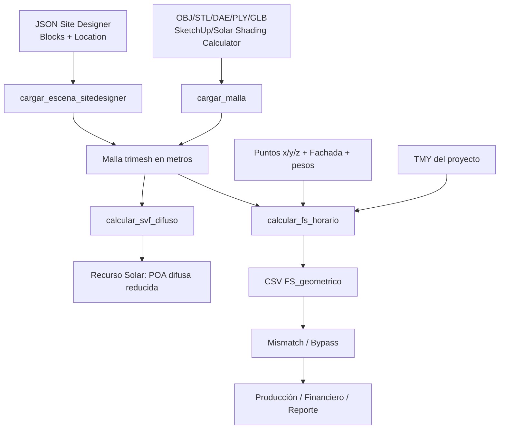

# Design: CodeSpec del módulo Sombras SketchUp

## Flujo de datos

## Contrato geométrico

- Coordenadas: `X=Este`, `Y=Norte`, `Z=arriba`.
- Unidad interna: metros.
- SketchUp/formatos generales: escala explícita seleccionada por el usuario.
- Site Designer: milímetros, escala fija `0.001`.
- Norte: giro horario visto desde arriba; se aplica como `-theta` alrededor de Z.
- No se deben incluir los paneles en la malla de obstáculos.
- Puntos dentro o demasiado próximos a sólidos generan advertencia.

## Contrato temporal

- El TMY del proyecto es obligatorio para sombra horaria.
- Si el índice TMY es naive, se localiza con la zona horaria configurada.
- La salida conserva `timestamp_utc` y exporta `Mes/Dia/Hora` compatibles con Producción/Mismatch.
- Horas con elevación solar menor a `1°` no se exportan.

## Contrato de estado

- `sk_df_fs`, `sk_firma` y `csv_fs_sketchup_bytes` representan el cálculo horario activo.
- Cambios de archivo, escala, norte, transparencia, ubicación, TMY o puntos invalidan el resultado anterior.
- `factor_svf_isotropico`, `factor_svf_tilt_az` y `sk_df_svf` representan el último SVF calculado.
- Calcular SVF invalida `recurso_solar_ok` para forzar recomputación del POA.
