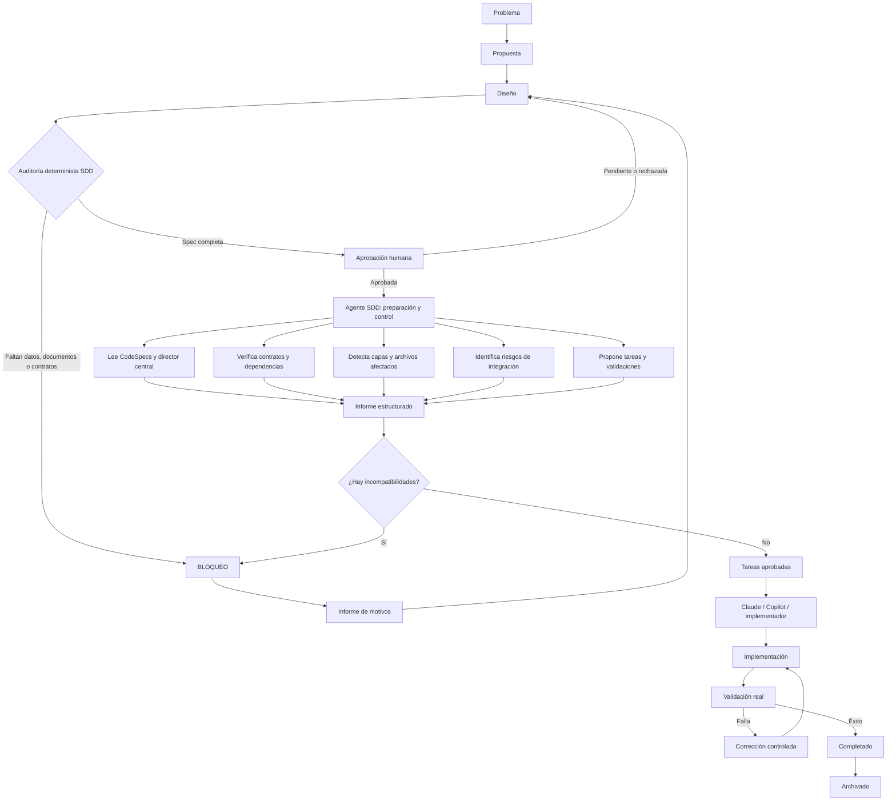

# Esquema de conexiones SDD

## Flujo principal



## Flujo lineal equivalente

```text
PROBLEMA
   |
   v
PROPUESTA
   |
   v
DISEÑO
   |
   v
AUDITORÍA DETERMINISTA SDD
   |------------------------------|
   |                              |
   v                              v
BLOQUEO                      SPEC COMPLETA
   |                              |
   v                              v
Corregir Spec              APROBACIÓN HUMANA
                                  |----------|
                                  |          |
                                  v          v
                            Pendiente    APROBADA
                                             |
                                             v
                              AGENTE SDD DE PREPARACIÓN
                                             |
                    ------------------------------------------
                    |           |          |        |         |
                    v           v          v        v         v
                Contratos  Dependencias Capas  Riesgos  Validaciones
                    |           |          |        |         |
                    -------------- INFORME ------------------
                                             |
                                             v
                                      TAREAS EJECUTABLES
                                             |
                                             v
                                    IMPLEMENTACIÓN
                                             |
                                             v
                                    VALIDACIÓN REAL
                                      |-------------|
                                      |             |
                                      v             v
                                    Falla         Éxito
                                      |             |
                                      v             v
                                  Corrección   COMPLETADO
                                                    |
                                                    v
                                                ARCHIVADO
```

## Conexiones por responsabilidad

| Origen | Conexión | Destino | Propósito |
|---|---|---|---|
| `problema.md` | definición del problema | `propuesta.md` | plantear una solución |
| `propuesta.md` | alternativa recomendada | `diseno.md` | describir el contrato técnico |
| `diseno.md` | entradas, salidas, dependencias | auditoría SDD | comprobar suficiencia |
| auditoría SDD | bloqueos y requisitos faltantes | equipo humano | corregir la Spec |
| Spec completa | solicitud de aprobación | equipo humano | autorizar avance |
| Spec aprobada | contexto del director central | agente SDD | preparar el trabajo |
| agente SDD | informe estructurado | Claude / Copilot | orientar implementación |
| informe | tareas propuestas | `tareas.md` | organizar trabajo ejecutable |
| tareas | archivos autorizados | implementador | realizar cambios |
| implementación | cambios de código | validación real | comprobar comportamiento |
| validación real | resultado | equipo humano | aceptar o corregir |

## Qué entra y qué sale del agente

### Entradas

- Los seis documentos de la Spec.
- `CodeSpecs/00-director/vision.md`.
- `CodeSpecs/00-director/arquitectura-global.md`.
- `CodeSpecs/00-director/contratos-entre-modulos.md`.
- `CodeSpecs/00-director/mapa-dependencias.md`.
- `CodeSpecs/00-director/registro-de-decisiones.md`.
- `CodeSpecs/00-director/separacion-apps.md`.
- Referencias documentales incluidas en esos archivos y en la propia Spec.

### Salidas

- Estado de la auditoría.
- Documentos o secciones faltantes.
- Requisitos incompletos.
- Capas afectadas.
- Archivos probablemente afectados.
- Riesgos de integración.
- Comandos de validación detectados.
- Tareas propuestas por Claude, cuando corresponda.
- Bloqueo explícito con sus motivos.

## Límites del agente

```text
PUEDE leer y analizar
PUEDE verificar
PUEDE informar
PUEDE proponer
PUEDE bloquear

NO puede editar código
NO puede editar Specs
NO puede cambiar contratos
NO puede decidir arquitectura
NO puede aprobar
NO puede ejecutar validaciones reales por el equipo
NO puede marcar completado
```

## Comandos

Las tareas están disponibles en `.vscode/tasks.json`. Para abrirlas en VS Code,
usa `Ctrl+Shift+P`, ejecuta **Tasks: Run Task** y selecciona una tarea `SDD`.
La ruta de la Spec se solicita al iniciar cada tarea.

### Tarea de auditoría y alertas tempranas

Selecciona **SDD: auditar Spec (alertas tempranas)**. Esta tarea:

- ejecuta la auditoría determinista;
- muestra `SDD ALERTA [BLOQUEO]` o `SDD ALERTA [RIESGO]` en la terminal;
- devuelve código de salida `2` si la Spec no está preparada para revisión;
- no modifica archivos ni activa Claude.

### Tarea de preparación con Claude

Selecciona **SDD: preparar revisión Claude (solo aprobada)** únicamente después
de completar y aprobar la Spec. La tarea devuelve código `2` si falta la
aprobación, aunque los documentos estén completos. También requiere
`ANTHROPIC_API_KEY` y el parámetro `--review`.

Auditoría:

```bash
pnpm exec tsx scripts/sdd-agent.ts \
   --spec CodeSpecs/01-datos-proyecto \
   --fail-on-block
```

Preparación posterior a aprobación:

```bash
ANTHROPIC_API_KEY=... pnpm exec tsx scripts/sdd-agent.ts \
   --spec CodeSpecs/01-datos-proyecto --review \
   --fail-on-preparation-block
```

## Idea central

```text
El agente SDD es la puerta entre una Spec aprobada y la implementación.

No construye el cambio.
No lo aprueba.
No lo valida por sí solo.

Comprueba que el trabajo esté preparado, organiza el contexto y detiene
el flujo cuando hacerlo sería inseguro o técnicamente indefinido.
```
